

<picture>
  <source media="(prefers-color-scheme: dark)" srcset="assets/overview-dark.svg">
  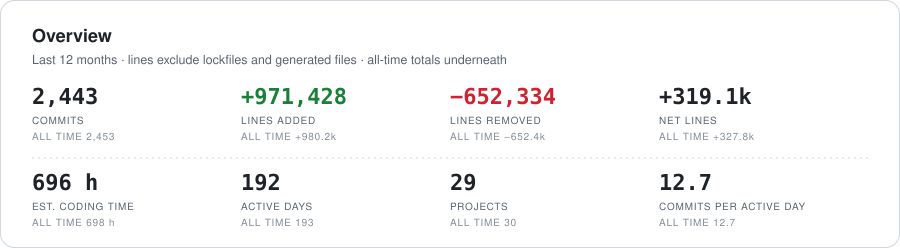
</picture>

<picture>
  <source media="(prefers-color-scheme: dark)" srcset="assets/activity-dark.svg">
  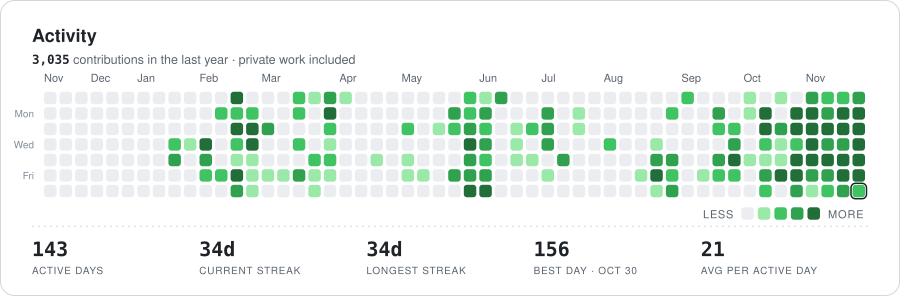
</picture>

<picture>
  <source media="(prefers-color-scheme: dark)" srcset="assets/churn-dark.svg">
  
</picture>

<picture>
  <source media="(prefers-color-scheme: dark)" srcset="assets/rhythm-dark.svg">
  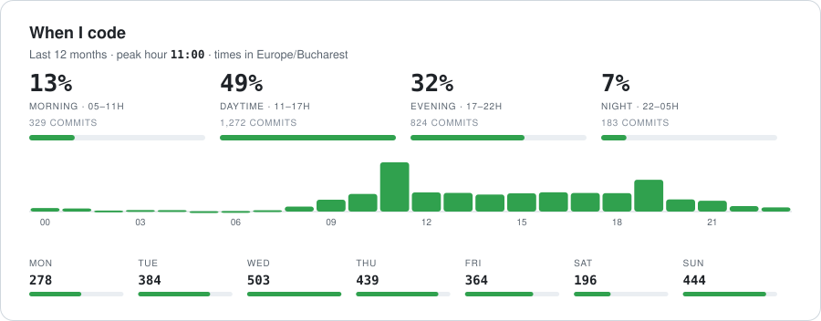
</picture>

<picture>
  <source media="(prefers-color-scheme: dark)" srcset="assets/punchcard-dark.svg">
  
</picture>

<picture>
  <source media="(prefers-color-scheme: dark)" srcset="assets/projects-dark.svg">
  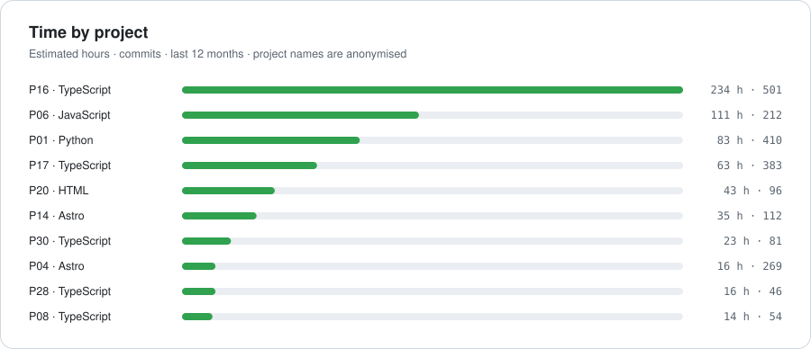
</picture>

<picture>
  <source media="(prefers-color-scheme: dark)" srcset="assets/languages-dark.svg">
  
</picture>

<picture>
  <source media="(prefers-color-scheme: dark)" srcset="assets/style-dark.svg">
  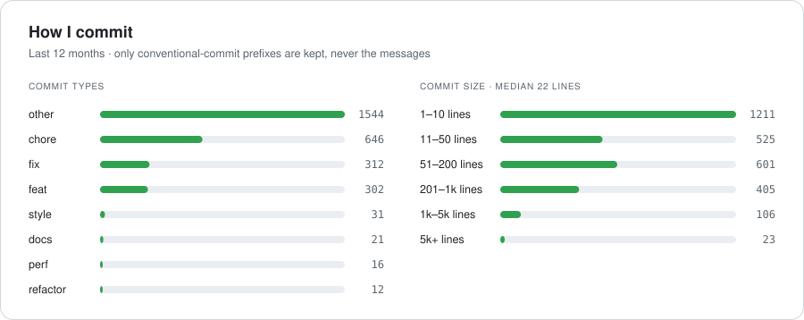
</picture>

<picture>
  <source media="(prefers-color-scheme: dark)" srcset="assets/insights-dark.svg">
  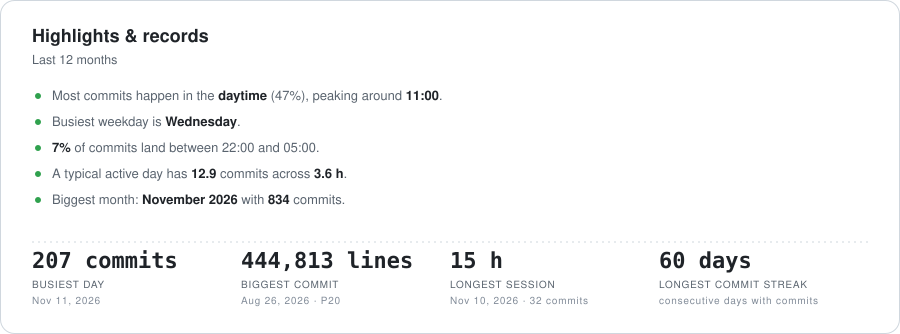
</picture>

<picture>
  <source media="(prefers-color-scheme: dark)" srcset="assets/months-dark.svg">
  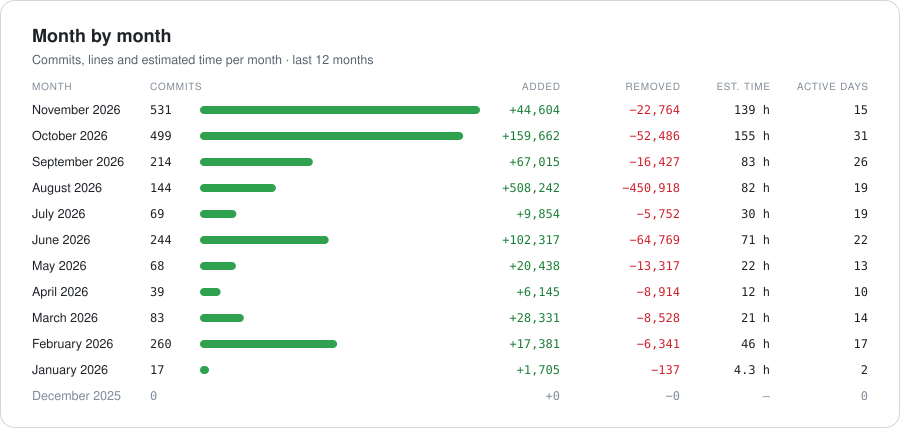
</picture>

<picture>
  <source media="(prefers-color-scheme: dark)" srcset="assets/claude-dark.svg">
  
</picture>

<a href="https://open.spotify.com"><picture><source media="(prefers-color-scheme: dark)" srcset="assets/spotify-head-056b69-dark.svg"></picture></a> 
<a href="https://open.spotify.com/track/6KTJrH8rLM4TefZcc9XFQF"><picture><source media="(prefers-color-scheme: dark)" srcset="assets/track-0-056b69-dark.svg">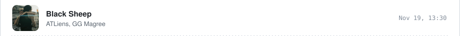</picture></a> 
<a href="https://open.spotify.com/track/7hPSxZemhzDIh4uaKpjIfP"><picture><source media="(prefers-color-scheme: dark)" srcset="assets/track-1-056b69-dark.svg">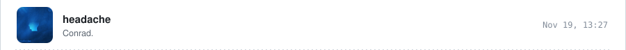</picture></a> 
<a href="https://open.spotify.com/track/7mPCgCK0XzmltsHj6IZjtL"><picture><source media="(prefers-color-scheme: dark)" srcset="assets/track-2-056b69-dark.svg">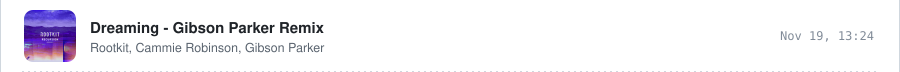</picture></a> 
<a href="https://open.spotify.com/track/0FJ57QkOsbHFKJxwpiRgNP"><picture><source media="(prefers-color-scheme: dark)" srcset="assets/track-3-056b69-dark.svg">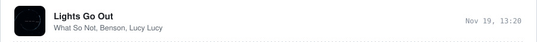</picture></a> 
<a href="https://open.spotify.com/track/325wgY6CoL30wsrRWTuveO"><picture><source media="(prefers-color-scheme: dark)" srcset="assets/track-4-056b69-dark.svg">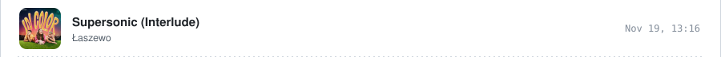</picture></a> 
<a href="https://open.spotify.com/track/0F1VAVqj021UkGntiDz4nx"><picture><source media="(prefers-color-scheme: dark)" srcset="assets/track-5-056b69-dark.svg">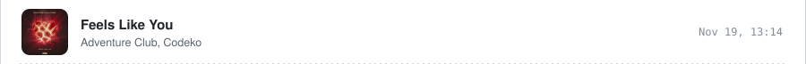</picture></a> 
<a href="https://open.spotify.com/track/5GdlsWmNyourbjreXO8cW4"><picture><source media="(prefers-color-scheme: dark)" srcset="assets/track-6-056b69-dark.svg">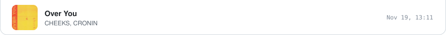</picture></a>

Listening data and cover art from <a href="https://open.spotify.com">Spotify</a> · times in Europe/Bucharest

### Zoom into a period
click a year, then a month

<b>2026</b> · 2,515 commits

 

<picture>
  <source media="(prefers-color-scheme: dark)" srcset="assets/period-2026-dark.svg">
  
</picture>

November 2026 · 878 commits

 

<picture>
  <source media="(prefers-color-scheme: dark)" srcset="assets/period-2026-11-dark.svg">
  
</picture>

October 2026 · 499 commits

 

<picture>
  <source media="(prefers-color-scheme: dark)" srcset="assets/period-2026-10-dark.svg">
  
</picture>

September 2026 · 214 commits

 

<picture>
  <source media="(prefers-color-scheme: dark)" srcset="assets/period-2026-09-dark.svg">
  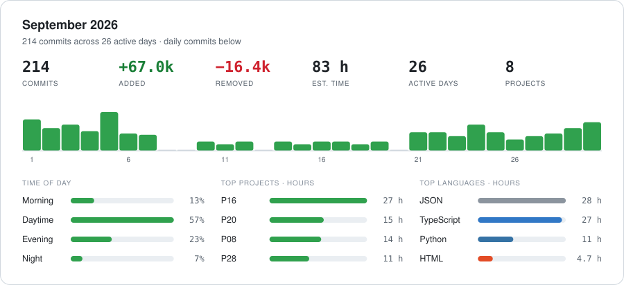
</picture>

August 2026 · 144 commits

 

<picture>
  <source media="(prefers-color-scheme: dark)" srcset="assets/period-2026-08-dark.svg">
  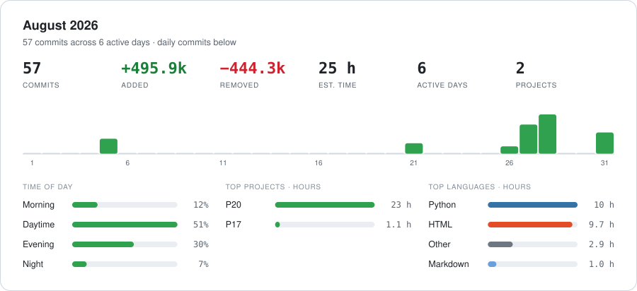
</picture>

July 2026 · 69 commits

 

<picture>
  <source media="(prefers-color-scheme: dark)" srcset="assets/period-2026-07-dark.svg">
  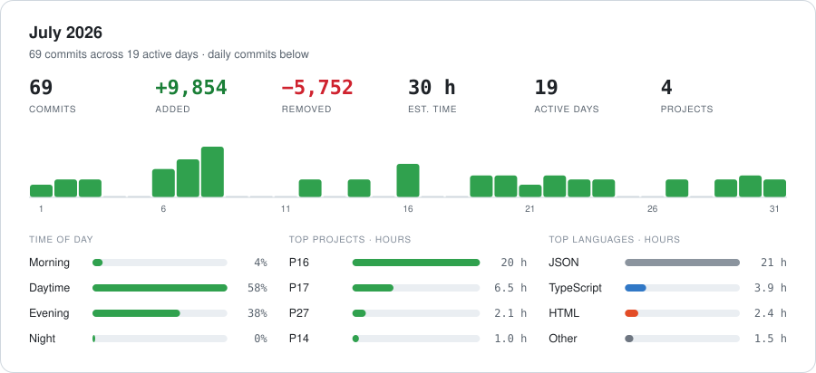
</picture>

June 2026 · 244 commits

 

<picture>
  <source media="(prefers-color-scheme: dark)" srcset="assets/period-2026-06-dark.svg">
  
</picture>

May 2026 · 68 commits

 

<picture>
  <source media="(prefers-color-scheme: dark)" srcset="assets/period-2026-05-dark.svg">
  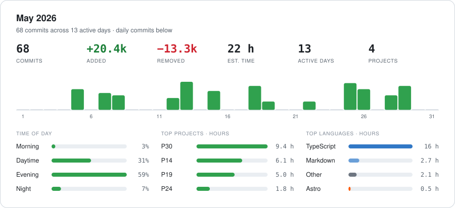
</picture>

April 2026 · 39 commits

 

<picture>
  <source media="(prefers-color-scheme: dark)" srcset="assets/period-2026-04-dark.svg">
  
</picture>

March 2026 · 83 commits

 

<picture>
  <source media="(prefers-color-scheme: dark)" srcset="assets/period-2026-03-dark.svg">
  
</picture>

February 2026 · 260 commits

 

<picture>
  <source media="(prefers-color-scheme: dark)" srcset="assets/period-2026-02-dark.svg">
  
</picture>

January 2026 · 17 commits

 

<picture>
  <source media="(prefers-color-scheme: dark)" srcset="assets/period-2026-01-dark.svg">
  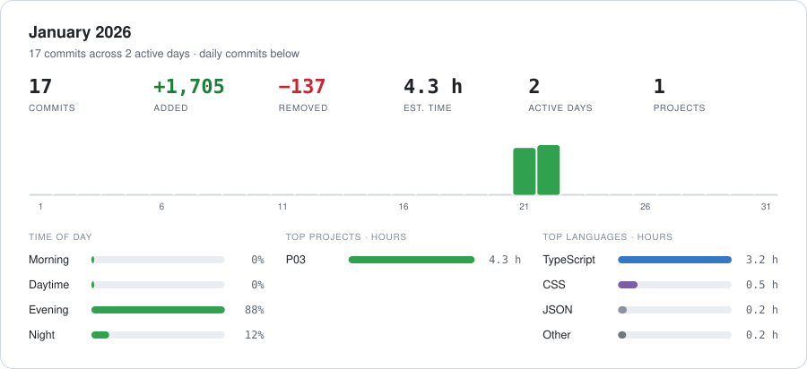
</picture>

<b>2024</b> · 10 commits

 

<picture>
  <source media="(prefers-color-scheme: dark)" srcset="assets/period-2024-dark.svg">
  
</picture>

August 2024 · 10 commits

 

<picture>
  <source media="(prefers-color-scheme: dark)" srcset="assets/period-2024-08-dark.svg">
  
</picture>

Generated from the GitHub API, private repos included (aggregates only, no repo names). Source in <code>scripts/</code> · <a href="https://galbir.github.io/Galbir/">live filterable version</a>

